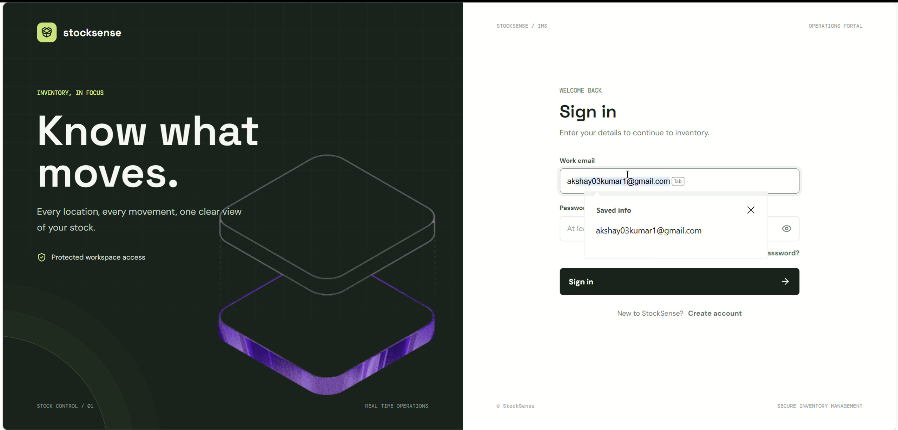
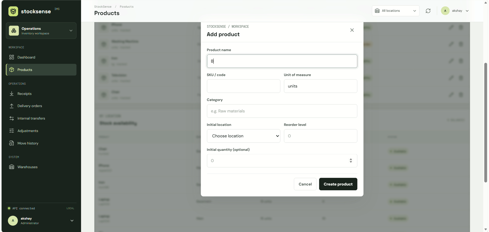
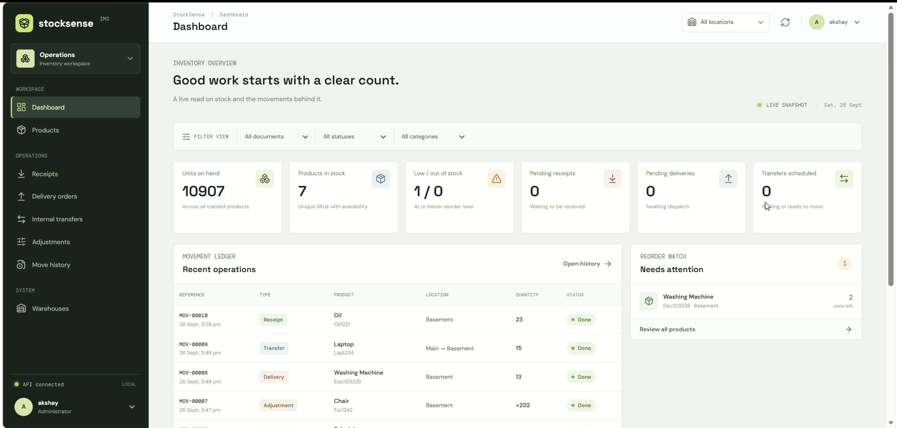
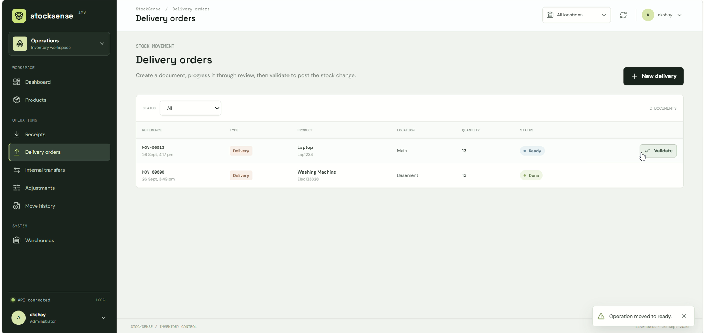
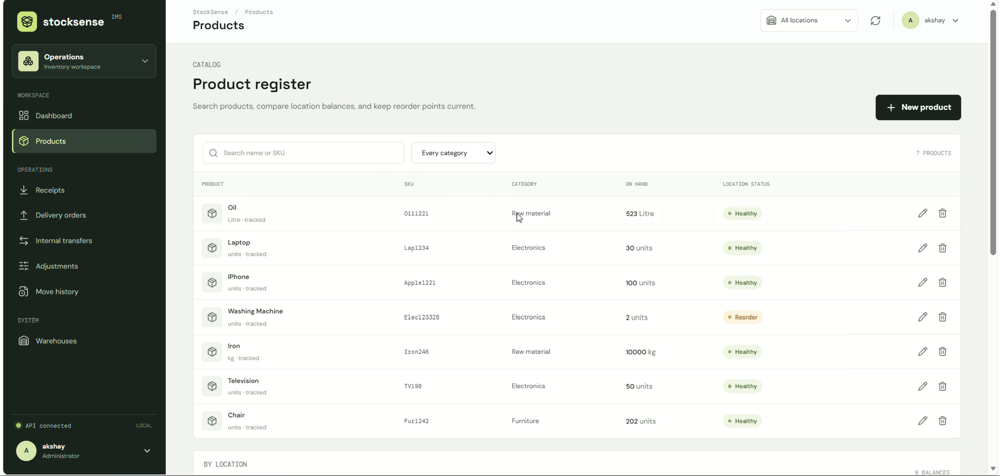
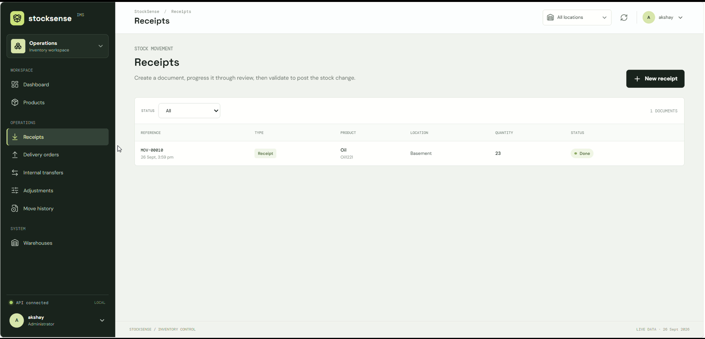

# 📦 StockSense

### Centralized Real-Time Inventory & Warehouse Management System

StockSense is a full-stack inventory management platform designed to simplify stock tracking and warehouse operations through a centralized dashboard.

It enables inventory teams to manage products, monitor stock levels, identify low-stock items, and manage day-to-day inventory operations such as **receipts, deliveries, transfers, and inventory adjustments**.

> **StockSense — Inventory Management, Simplified.**

---

## 📌 Problem Statement

Traditional inventory management becomes difficult as businesses grow and handle:

* Large product catalogs
* Multiple warehouses
* Frequent stock movements
* Manual stock updates
* Product transfers
* Receipts and deliveries
* Inventory adjustments
* Low-stock situations

Without a centralized system, it becomes difficult to answer basic operational questions:

* How much stock is currently available?
* Which products are running low?
* Which warehouse contains the inventory?
* What inventory activity happened recently?
* How has the stock changed?

StockSense addresses these problems by providing a centralized platform for inventory visibility and warehouse operations.

---

# 🎯 Project Objective

The primary objective of StockSense is to provide a centralized system that allows warehouse teams to:

1. Manage products efficiently.
2. Monitor real-time inventory levels.
3. Search and filter products quickly.
4. Detect low-stock products.
5. Manage warehouse inventory operations.
6. Track stock movements.
7. Handle receipts, deliveries, transfers, and adjustments.
8. Provide a simple dashboard for operational visibility.

---

# ✨ Features

## 📊 1. Inventory Dashboard

The dashboard provides a centralized overview of the inventory.

It provides visibility into:

* Total products
* Total available stock
* Low-stock products
* Recent inventory activity
* Selected warehouse
* Stock-related information

Instead of navigating through multiple pages, users can quickly understand the current inventory state from the dashboard.

---

## 📦 2. Product Management

StockSense provides a dedicated product management module.

Users can:

* Add products
* Edit products
* Delete products
* View product information
* View SKU
* View category
* Monitor current stock
* Configure reorder levels

---

## 🔎 3. Product Search

The product management interface provides product search capabilities.

Users can search using:

* Product name
* SKU
* Category

This becomes particularly useful when managing a large inventory.

---

## ⚠️ 4. Low Stock Detection

StockSense monitors product quantities against configured reorder levels.

The system identifies a product as low-stock when:

```text
Current Stock <= Reorder Level
```

For example:

```text
Current Stock  = 8
Reorder Level  = 10

8 <= 10
```

Therefore, the product requires attention.

This helps inventory teams identify products that may need replenishment.

---

## 🏭 5. Warehouse Management

StockSense is designed around warehouse-based inventory operations.

The system supports workflows involving:

* Warehouse selection
* Stock tracking
* Stock transfers
* Receipts
* Deliveries
* Inventory adjustments

---

## 🔄 6. Stock Transfers

Stock can be transferred between warehouse locations.

Conceptually:

```text
Warehouse A
     │
     │  Transfer 20 units
     ▼
Warehouse B
```

The inventory quantities must be updated accordingly.

```text
Warehouse A
100 → 80

Warehouse B
30 → 50
```

---

## 📥 7. Stock Receipts

Stock receipts represent inventory entering a warehouse.

Example:

```text
Supplier
   │
   │ +100 units
   ▼
Warehouse
```

The inventory quantity is updated accordingly.

---

## 📤 8. Deliveries

Deliveries represent inventory leaving a warehouse.

Example:

```text
Warehouse
   │
   │ -25 units
   ▼
Customer / Destination
```

The system updates the available inventory accordingly.

---

## 📝 9. Inventory Adjustments

Inventory may sometimes need manual adjustment because of:

* Damaged products
* Lost products
* Counting errors
* Physical inventory reconciliation
* Other operational discrepancies

StockSense provides an inventory adjustment workflow to account for these changes.

---

# 🏗️ System Architecture

StockSense follows a separated frontend/backend architecture.

```text
                    ┌───────────────────────┐
                    │      StockSense       │
                    │      Web Client       │
                    └───────────┬───────────┘
                                │
                                │ HTTP / REST
                                ▼
                    ┌───────────────────────┐
                    │       Backend         │
                    │                       │
                    │ Controllers           │
                    │ Services              │
                    │ Repositories          │
                    │ Business Logic        │
                    └───────────┬───────────┘
                                │
                                │ JPA / ORM
                                ▼
                    ┌───────────────────────┐
                    │       Database        │
                    │                       │
                    │ Products              │
                    │ Inventory             │
                    │ Warehouses            │
                    │ Transactions          │
                    └───────────────────────┘
```

The frontend is responsible for the user experience and communicating with the backend.

The backend is responsible for business logic, validation, inventory operations, and persistence.

---

# 🧱 Backend Architecture

The backend follows a layered architecture:

```text
Client
  │
  ▼
Controller
  │
  ▼
Service
  │
  ▼
Repository
  │
  ▼
Database
```

### Controller Layer

Responsible for:

* Receiving HTTP requests
* Validating request input
* Calling service methods
* Returning HTTP responses

### Service Layer

Contains business logic such as:

* Product management
* Stock calculations
* Inventory operations
* Transfer logic
* Low-stock detection

### Repository Layer

Responsible for communicating with the database through the persistence layer.

---

# 📁 Project Structure

```text
StockSense/
│
├── Backend/
│   │
│   ├── src/
│   │   ├── main/
│   │   │   ├── java/
│   │   │   │
│   │   │   └── resources/
│   │   │
│   │   └── test/
│   │
│   └── pom.xml
│
├── Frontend/
│   │
│   ├── src/
│   ├── public/
│   ├── package.json
│   └── ...
│
├── README.md
└── package-lock.json
```

> The exact package names and files should correspond to the implementation in the repository.

---

# ⚙️ Configuration

For the backend, environment-specific configuration should be maintained through Spring Boot configuration files.

A typical structure is:

```text
Backend/
└── src/
    └── main/
        └── resources/
            ├── application.properties
            ├── application-dev.properties
            └── application-prod.properties
```

A typical database configuration looks like:

```properties
spring.application.name=stocksense

spring.datasource.url=jdbc:mysql://localhost:3306/stocksense
spring.datasource.username=root
spring.datasource.password=${DB_PASSWORD}

spring.datasource.driver-class-name=com.mysql.cj.jdbc.Driver

spring.jpa.hibernate.ddl-auto=update
spring.jpa.show-sql=true

server.port=8080
```

### Environment Variables

Sensitive credentials should not be committed to GitHub.

Instead:

```properties
spring.datasource.password=${DB_PASSWORD}
```

and configure:

```text
DB_PASSWORD=your_database_password
```

through the environment.

---

# 🗄️ Database Design

The inventory domain can be represented conceptually as:

```text
              ┌──────────────┐
              │   Product    │
              └──────┬───────┘
                     │
                     │
              ┌──────▼───────┐
              │  Inventory   │
              └──────┬───────┘
                     │
                     │
              ┌──────▼───────┐
              │  Warehouse   │
              └──────────────┘
```

Inventory operations can then be represented through transactional records:

```text
Warehouse
    │
    ├── Receipt
    │
    ├── Delivery
    │
    ├── Transfer
    │
    └── Adjustment
```

This allows the system to separate the current inventory state from the operations that modify it.

---

# 🔄 Inventory Workflow

## Receiving Stock

```text
Supplier
   │
   ▼
Receipt Created
   │
   ▼
Inventory Updated
   │
   ▼
Stock Increased
```

---

## Delivering Stock

```text
Delivery Created
      │
      ▼
Validate Available Stock
      │
      ▼
Update Inventory
      │
      ▼
Stock Decreased
```

---

## Transferring Stock

```text
Warehouse A
     │
     │ Validate Stock
     ▼
Decrease Source Inventory
     │
     ▼
Increase Destination Inventory
     │
     ▼
Transfer Completed
```

A robust implementation should treat this as one atomic business operation.

---

# 🔐 Data Validation

Inventory systems must prevent invalid operations.

Examples:

```text
Quantity < 0
      ↓
Reject request
```

```text
Transfer quantity > available stock
      ↓
Reject transfer
```

```text
Unknown product
      ↓
Return appropriate error
```

```text
Unknown warehouse
      ↓
Return appropriate error
```

---

# 🔒 Transaction Management

Inventory operations can involve multiple database changes.

For example, a transfer might require:

```text
1. Decrease source warehouse stock
2. Increase destination warehouse stock
3. Create transfer record
```

These operations should ideally execute within a transaction:

```text
BEGIN TRANSACTION

Decrease Source
       ↓
Increase Destination
       ↓
Create Transfer Record

COMMIT
```

If an operation fails:

```text
ROLLBACK
```

This prevents partially completed inventory operations.

---

# 🧠 Business Rules

Important inventory rules include:

### Stock Availability

```text
Requested Quantity <= Available Quantity
```

### Low Stock

```text
Current Stock <= Reorder Level
```

### Transfer

```text
Source Warehouse ≠ Destination Warehouse
```

### Quantity

```text
Quantity > 0
```

These rules should be enforced at the service/business layer rather than relying only on frontend validation.

---

# 🌐 API Architecture

The frontend communicates with the backend using REST APIs.

Conceptual API structure:

```text
/api/products
/api/inventory
/api/warehouses
/api/receipts
/api/deliveries
/api/transfers
/api/adjustments
```

Typical operations include:

```text
GET     → Retrieve information
POST    → Create operation
PUT     → Update information
DELETE  → Remove/deactivate information
```

---

# 🖥️ Frontend Architecture

The frontend provides interfaces for:

```text
Dashboard
   │
   ├── Products
   │
   ├── Inventory
   │
   ├── Warehouses
   │
   ├── Receipts
   │
   ├── Deliveries
   │
   ├── Transfers
   │
   └── Adjustments
```

The frontend communicates with the backend through API requests.

```text
React UI
   │
   ▼
API Service
   │
   ▼
REST API
   │
   ▼
Spring Boot Backend
```

---

# 🛠️ Technology Stack

The repository is organized into separate frontend and backend applications. The exact technology versions should be kept synchronized with the dependency files in the repository.

### Frontend

* React
* JavaScript
* CSS / UI framework used by the project
* REST API integration

### Backend

* Java
* Spring Boot
* Spring Data JPA
* Hibernate
* REST APIs

### Database

* MySQL

### Development Tools

* Git
* GitHub
* Postman
* IntelliJ IDEA / VS Code
* Maven
* npm

---

# 🚀 Getting Started

## Prerequisites

Install:

```text
Java
Maven
Node.js
npm
MySQL
Git
```

---

## 1. Clone Repository

```bash
git clone https://github.com/Pr0818/StockSense.git

cd StockSense
```

---

# 2. Backend Setup

```bash
cd Backend
```

Configure the database in:

```text
src/main/resources/application.properties
```

Create the database:

```sql
CREATE DATABASE stocksense;
```

Then run the backend:

```bash
mvn spring-boot:run
```

The backend will run on the configured Spring Boot port.

---

# 3. Frontend Setup

Open another terminal:

```bash
cd Frontend
```

Install dependencies:

```bash
npm install
```

Start the development server:

```bash
npm run dev
```

---

# 🧪 Testing

Recommended testing layers:

```text
Unit Tests
    │
    ▼
Service Tests
    │
    ▼
Repository Tests
    │
    ▼
Integration Tests
    │
    ▼
API Tests
```

Important scenarios to test include:

* Product creation
* Product update
* Product deletion
* Product search
* Low-stock detection
* Stock receipt
* Stock delivery
* Stock transfer
* Invalid quantity
* Insufficient stock
* Invalid product
* Invalid warehouse

---

# 🐳 Docker

StockSense can be further containerized using Docker.

A production-oriented architecture could be:

```text
             ┌──────────────┐
             │   Frontend   │
             │   Container  │
             └───────┬──────┘
                     │
                     ▼
             ┌──────────────┐
             │   Backend    │
             │   Container  │
             └───────┬──────┘
                     │
                     ▼
             ┌──────────────┐
             │    MySQL     │
             │   Container  │
             └──────────────┘
```

Docker Compose can be used to manage the complete development environment.

---

# 📈 Scalability Considerations

As the number of products and warehouses grows, several optimizations can be introduced.

### Database Indexing

Useful indexes can be created for frequently searched fields such as:

```text
SKU
Product Name
Category
Warehouse ID
```

### Caching

Redis can be introduced for frequently accessed information:

```text
Product details
Dashboard statistics
Warehouse information
Frequently searched products
```

### Event-Driven Architecture

Kafka can eventually be introduced for asynchronous inventory events:

```text
Stock Updated
      │
      ▼
    Kafka
   /  |  \
  /   |   \
Alert Audit Analytics
```

This should only be introduced when the system actually benefits from asynchronous processing.

---

# 🔮 Future Enhancements

Potential improvements include:

* 🔐 JWT authentication
* 👥 Role-based access control
* 📝 Detailed audit logs
* 📊 Advanced inventory analytics
* 🔔 Automated low-stock notifications
* 📱 Mobile-responsive interface
* 📷 Barcode / QR-code scanning
* 🧾 Invoice generation
* 📦 Batch and expiry tracking
* ⚡ Redis caching
* 📨 Kafka-based event processing
* 🐳 Docker deployment
* ☁️ Cloud deployment
* 📈 Inventory forecasting
* 🧪 Automated integration testing
* 🔄 Database migration using Flyway/Liquibase

---

# 💡 Engineering Challenges

Some of the important engineering challenges in an inventory management system include:

### 1. Maintaining Accurate Stock

Every operation that changes inventory must update the stock consistently.

### 2. Concurrent Updates

Two users may attempt to modify the same inventory simultaneously.

This introduces potential race conditions.

### 3. Transaction Consistency

Multi-step operations such as transfers should not partially complete.

### 4. Auditability

Inventory managers should be able to determine why inventory changed.

### 5. Performance

Product search and dashboard queries should remain efficient as the inventory grows.

---

# 🎓 What This Project Demonstrates

StockSense demonstrates practical understanding of:

* Full-stack development
* REST API design
* Backend architecture
* Layered architecture
* CRUD operations
* Database modeling
* Inventory domain modeling
* Business-rule implementation
* Product search
* Stock management
* Warehouse workflows
* Transaction management
* Frontend/backend integration
* Scalable system design

---

# 📸 Screenshots










---

# 🤝 Contributing

Contributions are welcome.

```bash
git checkout -b feature/new-feature
```

Make your changes and commit:

```bash
git add .
git commit -m "feat: add new inventory feature"
```

Push:

```bash
git push origin feature/new-feature
```

Then open a Pull Request.

---

# 📄 License

This project is currently developed as a collaborative/hackathon project.

---

# 👨‍💻 Contributors

Built collaboratively by the StockSense development team.

---

<p align="center">

### 📦 StockSense

**Centralized Inventory. Smarter Operations.**

</p>
